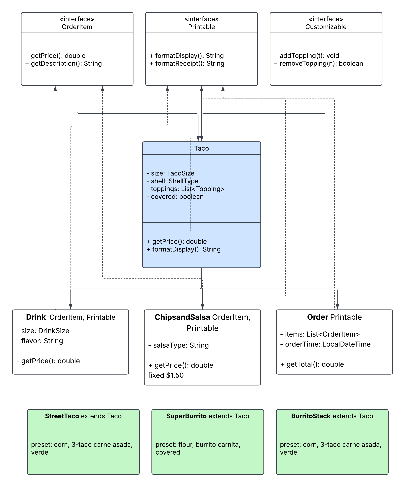

# 🌮 Stacks & Salsa — Taco Shop POS

A Java console-based Point of Sale application for **Stacks & Salsa**, a custom taco shop. Built as a Pluralsight Year Up Capstone 2 project.

---

## What It Does

- Build fully custom tacos — size, shell, meat, cheese, toppings, sauces, covered option
- Order from 3 signature presets — Street Tacos, Super Burrito, Burrito Stack 
- Add drinks and chips & salsa to any order
- Live price counter updates as you build
- Saves a receipt `.txt` file for every completed order
- View past orders from the main menu

---

## How to Run

1. Clone the repo and open in IntelliJ IDEA
2. Navigate to `Main.java` and click ▶ Run
3. Requires **Java 17** and **Maven**

---

## Project Structure

```
enums/        → TacoSize, ShellType, DrinkSize (with pricing)
interfaces/   → IOrderItem, IPrintable, ICustomizable
models/       → Taco, Drink, ChipsAndSalsa, Order, Receipt + 3 signature tacos
services/     → DisplayUtils, OrderServices, ReceiptServices
ui/           → HomeScreen, OrderScreen, TacoScreen, DrinkScreen, ChipsScreen, CheckoutScreen
```

---

## OOP Concepts Used

- **Interfaces** — `IOrderItem`, `IPrintable`, `ICustomizable`
- **Inheritance** — `StreetTaco`, `SuperBurrito`, `BurritoStack` all extend `Taco`
- **Enums with methods** — `TacoSize` stores size-dependent pricing logic
- **Separation of concerns** — models, services, and UI are fully separated

---

## Class Diagram



---

*Built by Sadaqa Salaam — Pluralsight Year Up Capstone 2*
